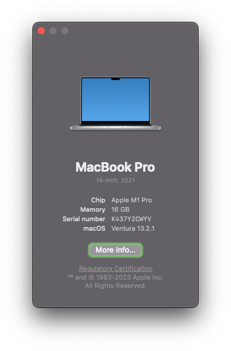
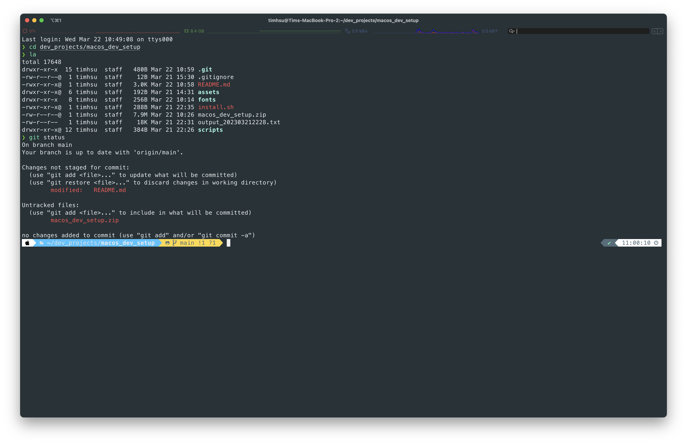

# MACOS DEVELOPER SETUP

[](https://github.com/Chindada/macos_dev_setup)
[](https://github.com/Chindada/macos_dev_setup/releases/latest)
[](https://www.apple.com/tw/macos)
[](https://www.apple.com/tw/macos)



## **Project Structure**

```bash
|-- README.md          # The file you are reading now
|-- assets             # Images
|-- fonts              # Fonts
|   |-- Hack           # Hack font
|   |-- JetBrainsMono     # JetBrainsMono font
|   |-- MesloLGS          # MesloLGS font
|   |-- Monoid            # Monoid font
|   |-- OperatorMono      # OperatorMono font
|   `-- SourceCodePro     # SourceCodePro font
|-- install.sh         # Main script
`-- scripts
    |-- 01_ohmyzsh.sh         # Install ohmyzsh
    |-- 02_homebrew.sh        # Install homebrew
    |-- 03_golang.sh          # Install golang
    |-- 04_flutter.sh         # Install flutter
    |-- 05_node.sh            # Install node
    |-- 06_python.sh          # Install python
    |-- 07_homebrew_utils.sh  # Install homebrew utils
    |-- 08_powerlevel10k.sh   # Install powerlevel10k
    |-- 09_fonts.sh           # Install fonts
    `-- 10_mas_apps.sh        # Install mas apps
```

## **(Optional) CalDigit Thunderbolt Station Driver(TS3 Plus)**

- Skip this step, if you don't have CalDigit Thunderbolt Station
  1. Reduce secruity policy in recovery os [Reference](https://support.apple.com/guide/deployment/startup-security-dep5810e849c/web)
  2. [Downdload](https://downloads.caldigit.com/CalDigit-Thunderbolt-Station-Mac-Drivers.zip) and manual install driver

---

## **Step 1: Install Xcode CLI tools and Rosetta2**

- Execute below commands, step by step

  ```bash
  sudo xcode-select --install
  ```

  ```bash
  sudo softwareupdate --install-rosetta --agree-to-license
  ```

---

## **Step 2: Directly Download**

- In this case, base folder is `~/dev_projects`, you can change it to your own folder

  ```bash
  VERSION=1.3.0
  BASE_DIR=~/dev_projects
  ```

  ```bash
  mkdir -p $BASE_DIR
  curl -fSL https://github.com/Chindada/macos_dev_setup/archive/refs/tags/v$VERSION.zip -o macos_dev_setup.zip
  unzip -q macos_dev_setup.zip -d $BASE_DIR
  rm macos_dev_setup.zip
  mv $BASE_DIR/macos_dev_setup-$VERSION $BASE_DIR/macos_dev_setup
  cd $BASE_DIR/macos_dev_setup
  ```

## **Step 3: Install**

- Install and the output will be saved to `$BASE_DIR/macos_dev_setup_output_$(date +%Y%m%d%H%M).txt`

  ```bash
  BASE_DIR=~/dev_projects
  cd $BASE_DIR/macos_dev_setup
  ./install.sh 2>&1 | tee $BASE_DIR/macos_dev_setup_output_$(date +%Y%m%d%H%M).txt
  ```

---

## **Step 4: Post Install**

### **zsh**

1. Launch iterm2, it will prompt to initial powerlevel10k
2. Paste `yyyy3121111121y1yy`
    - The zsh will be like below



### **Xcode**

1. Run below commands

    ```bash
    sudo xcodebuild -license
    ```

    ```bash
    sudo xcode-select --switch /Applications/Xcode.app/Contents/Developer
    ```

    ```bash
    sudo xcodebuild -runFirstLaunch
    ```

2. Manual launch Xcode, let it finish the first initial

### **Android Studio**

- **Manual launch Android Studio, install Android SDK**, then run below command

  ```bash
  flutter doctor --android-licenses
  ```

### **SSH**

- Generate SSH key or import SSH key
  - If import, permission should be 600 `chmod 600 ~/.ssh/id_ed25519`
  - If new, add SSH key to github

  ```bash
  ssh-keygen -t ed25519 -f ~/.ssh/id_ed25519 -q -N "" -C "maochindada@gmail.com"
  ```

  ```bash
  eval "$(ssh-agent -s)"

  touch ~/.ssh/config
  echo 'Host *
    AddKeysToAgent yes
    UseKeychain yes
    IdentityFile ~/.ssh/id_ed25519
    StrictHostKeyChecking no' >~/.ssh/config

  ssh-add --apple-use-keychain ~/.ssh/id_ed25519
  cat ~/.ssh/id_ed25519.pub
  ```

  > Note: The --apple-use-keychain option stores the passphrase in your keychain for you when you add an SSH key to the ssh-agent. If you chose not to add a passphrase to your key, run the command without the --apple-use-keychain option.
  >> The --apple-use-keychain option is in Apple's standard version of ssh-add. In MacOS versions prior to Monterey (12.0), the --apple-use-keychain and --apple-load-keychain flags used the syntax -K and -A, respectively.
  >> If you don't have Apple's standard version of ssh-add installed, you may receive an error. For more information, see "Error: ssh-add: illegal option -- K."

### **GPG Key**

- Generate GPG key
  - **There should not be any key before generate**

```bash
gpg --full-generate-key
```


- Export GPG key and set git config

  ```bash
  SEC_KEY_ID=$(gpg --list-secret-keys --with-colons | awk -F: '$1 == "sec" {print $5}')
  gpg --armor --export $SEC_KEY_ID
  git config --global user.signingkey $SEC_KEY_ID
  git config --global gpg.program gpg
  git config --global commit.gpgsign true
  git config --global tag.gpgSign true
  ```

- Test GPG sign

  ```bash
  echo "test" | gpg --clearsign
  ```

## **Step 5: Final check**

- (Optional) If you want to contribute to this project, you can clone it using SSH

  ```bash
  BASE_DIR=~/dev_projects
  git clone git@github.com:Chindada/macos_dev_setup.git $BASE_DIR/macos_dev_setup
  ```

- Check the version of installed tools

  ```bash
  brew --version
  go version
  flutter --version
  node --version
  python3 --version
  git config --list
  ```

## References

1. [iTerm2 Themes](https://iterm2colorschemes.com)

## Author

- [**Tim Hsu**](https://github.com/Chindada)
