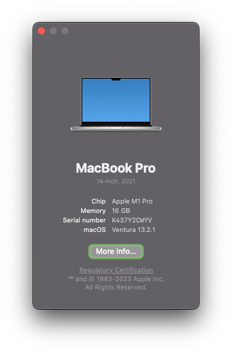

# **macOS Developer Setup**

[](https://www.apple.com/tw/macos)


## Install for command cli tools in macOS

```bash
sudo xcode-select --install
sudo xcode-select --switch /Applications/Xcode.app/Contents/Developer
```

---

## Install rosetta2 from command line

```bash
sudo softwareupdate --install-rosetta --agree-to-license
```

---

## (Optional) CalDigit Thunderbolt Station Driver(TS3 Plus)

- Reduce secruity policy in recovery os
- [Downdload Link](https://downloads.caldigit.com/CalDigit-Thunderbolt-Station-Mac-Drivers.zip)
- Manual install driver

---

## Clone project using https by username and password

```bash
mkdir -p ~/dev_projects
cd ~/dev_projects
git clone https://github.com/Chindada/macos_dev_setup.git
```

---

## Install

```bash
cd ~/dev_projects/macos_dev_setup
./install.sh
```

---

## Post-Steps

- Generate SSH key or import SSH key
- If new, add SSH key to github

```bash
ssh-keygen -t ed25519 -f ~/.ssh/id_ed25519 -q -N "" -C "maochindada@gmail.com"
eval "$(ssh-agent -s)"
echo 'Host *
  AddKeysToAgent yes
  UseKeychain yes
  IdentityFile ~/.ssh/id_ed25519
  StrictHostKeyChecking no' >~/.ssh/config

ssh-add -K ~/.ssh/id_ed25519
pbcopy <~/.ssh/id_ed25519.pub
cat ~/.ssh/id_ed25519.pub
```

```bash
rm -rf ~/dev_projects/macos_dev_setup
cd ~/dev_projects
git clone git@github.com:Chindada/macos_dev_setup.git

```

```bash
flutter doctor --android-licenses
echo "ulimit -n 1024">>~/.zshrc
```

## Check

```bash
git config --list
go version
flutter --version
node --version
```

## Authors

- [**Tim Hsu**](https://github.com/Chindada)
