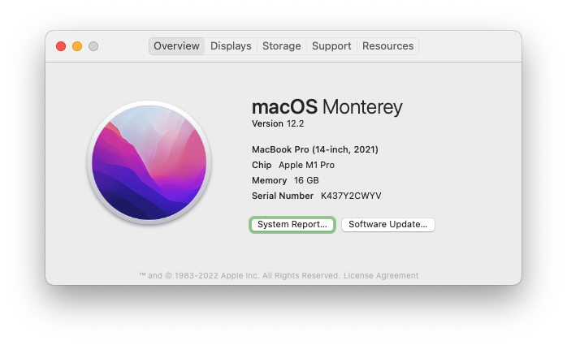

# **macOS Developer Setup** [](https://www.apple.com/tw/macos/monterey/)



---

## Install for command cli tools in macOS

```sh
sudo xcode-select --install
```

### *(Optional) Install rosetta2 from command line, or install TS3 Plus driver will lead to install in gui*

- Reduce secruity policy in recovery os
- [Downdload Link](https://downloads.caldigit.com/CalDigit-Thunderbolt-Station-Mac-Drivers.zip)
- Or `sudo softwareupdate --install-rosetta`

---

## Clone project using https by username and password

```sh
git clone https://gitlab.tocraw.com/root/macos_11_setup.git ~/dev_projects/macOS_11_setup
```

---

## Install

```sh
cd ~/dev_projects/macOS_11_setup && \
./install_apple_sillicon.sh
```

---

## Post-Steps(using ssh key)

```sh
rm -rf ~/dev_projects/macOS_11_setup && \
git clone git@gitlab.tocraw.com:root/macos_11_setup.git ~/dev_projects/macOS_11_setup
```

```sh
flutter pub global activate devtools
```

<!-- ```sh
smartctl -a disk3s1s1
``` -->
---

## Check Command

```sh
git config --list
go version
flutter --version
node --version
python --version
```

## Authors

- [**Tim Hsu**](https://gitlab.tocraw.com/root)
