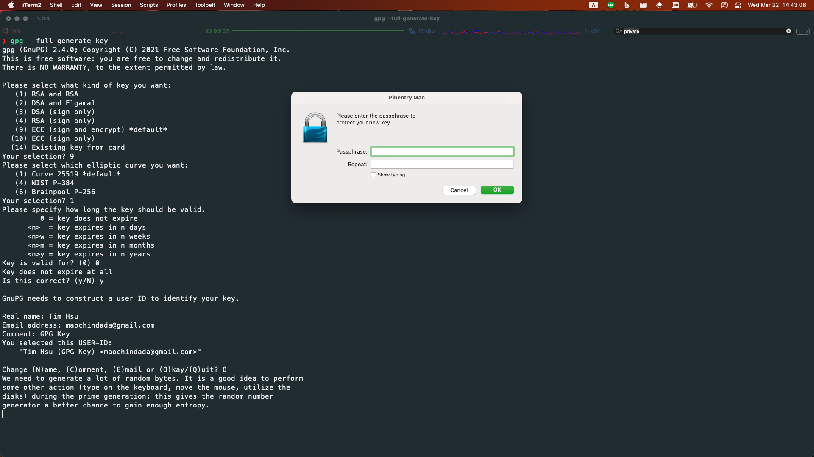

# MACOS DEVELOPER SETUP

[](https://github.com/Chindada/macos_dev_setup)
[](https://www.apple.com/tw/macos)
[](https://www.apple.com/tw/macos)


## Project Structure

```bash
|-- README.md          # The file you are reading now
|-- assets             # Images
|-- fonts              # Fonts
|   |-- Hack           # Hack font
|   |-- JetBrainsMono     # JetBrainsMono font
|   |-- MesloLGS          # MesloLGS font
|   |-- Monoid            # Monoid font
|   |-- OperatorMono      # OperatorMono font
|   `-- SourceCodePro     # SourceCodePro font
|-- install.sh         # Main script
`-- scripts
    |-- 01_ohmyzsh.sh         # Install ohmyzsh
    |-- 02_homebrew.sh        # Install homebrew
    |-- 03_golang.sh          # Install golang
    |-- 04_flutter.sh         # Install flutter
    |-- 05_node.sh            # Install node
    |-- 06_python.sh          # Install python
    |-- 07_homebrew_utils.sh  # Install homebrew utils
    |-- 08_powerlevel10k.sh   # Install powerlevel10k
    |-- 09_fonts.sh           # Install fonts
    `-- 10_mas_apps.sh        # Install mas apps
```

## **Step 1: Install CLI tools in macOS**

```bash
sudo xcode-select --install
sudo xcode-select --switch /Applications/Xcode.app/Contents/Developer
```

---

## **Step 2: Install Rosetta2 from command line**

```bash
sudo softwareupdate --install-rosetta --agree-to-license
```

---

## **Step 3: (Optional) CalDigit Thunderbolt Station Driver(TS3 Plus)**

- Reduce secruity policy in recovery os [Reference](https://support.apple.com/guide/deployment/startup-security-dep5810e849c/web)
- [Downdload](https://downloads.caldigit.com/CalDigit-Thunderbolt-Station-Mac-Drivers.zip) and manual install driver

---

## **Step 4: Download and Install**

- Directly download and unzip
- My root folder is `~/dev_projects`, you can change it to your own folder

```bash
ROOT_DIR=~/dev_projects
VERSION=1.0.0

mkdir -p $ROOT_DIR
curl -fSL https://github.com/Chindada/macos_dev_setup/archive/refs/tags/v$VERSION.zip -o macos_dev_setup.zip
unzip -q macos_dev_setup.zip -d $ROOT_DIR
rm macos_dev_setup.zip
mv $ROOT_DIR/macos_dev_setup-$VERSION $ROOT_DIR/macos_dev_setup
cd $ROOT_DIR/macos_dev_setup
```

- Install and the output will be saved to `output_$(date +%Y%m%d%H%M).txt`

```bash
./install.sh 2>&1 | tee output_$(date +%Y%m%d%H%M).txt
```

- if there is no error in the output, you can remove the folder

```bash
rm -rf $ROOT_DIR/macos_dev_setup
```

---

## **Step 5: Post install**

- Launch iterm2
- It will prompt to initial powerlevel10k
- Paste `yyyy3121111121y1yy` to terminal
- The iterm2 will be like below


- Flutter doctor

```bash
flutter doctor --android-licenses
```

- Generate SSH key or import SSH key
- If new, add SSH key to github

```bash
ssh-keygen -t ed25519 -f ~/.ssh/id_ed25519 -q -N "" -C "maochindada@gmail.com"
eval "$(ssh-agent -s)"

touch ~/.ssh/config
echo 'Host *
  AddKeysToAgent yes
  UseKeychain yes
  IdentityFile ~/.ssh/id_ed25519
  StrictHostKeyChecking no' >~/.ssh/config

ssh-add --apple-use-keychain ~/.ssh/id_ed25519
cat ~/.ssh/id_ed25519.pub
```

> Note: The --apple-use-keychain option stores the passphrase in your keychain for you when you add an SSH key to the ssh-agent. If you chose not to add a passphrase to your key, run the command without the --apple-use-keychain option.
>> The --apple-use-keychain option is in Apple's standard version of ssh-add. In MacOS versions prior to Monterey (12.0), the --apple-use-keychain and --apple-load-keychain flags used the syntax -K and -A, respectively.
>> If you don't have Apple's standard version of ssh-add installed, you may receive an error. For more information, see "Error: ssh-add: illegal option -- K."

- Generate GPG key, then add export to github
- There should not be any key in the list

```bash
gpg --full-generate-key
```



```bash
SEC_KEY_ID=$(gpg --list-secret-keys --with-colons | awk -F: '$1 == "sec" {print $5}')
gpg --armor --export $SEC_KEY_ID

git config --global user.signingkey $SEC_KEY_ID
git config --global gpg.program gpg
git config --global commit.gpgsign true
git config --global tag.gpgSign true
```

- Test GPG sign

```bash
echo "test" | gpg --clearsign
```

- Optional brew formula

```bash
brew install pre-commit
brew install cmake
brew install tmux
brew install gcc
```

## **Step 6: Final check**

- (Optional) If you want to contribute to this project, you can clone it using SSH

```bash
ROOT_DIR=~/dev_projects
git clone git@github.com:Chindada/macos_dev_setup.git $ROOT_DIR/macos_dev_setup
```

```bash
brew --version
git config --list
go version
flutter --version
node --version
python3 --version
```

## Author

- [**Tim Hsu**](https://github.com/Chindada)
